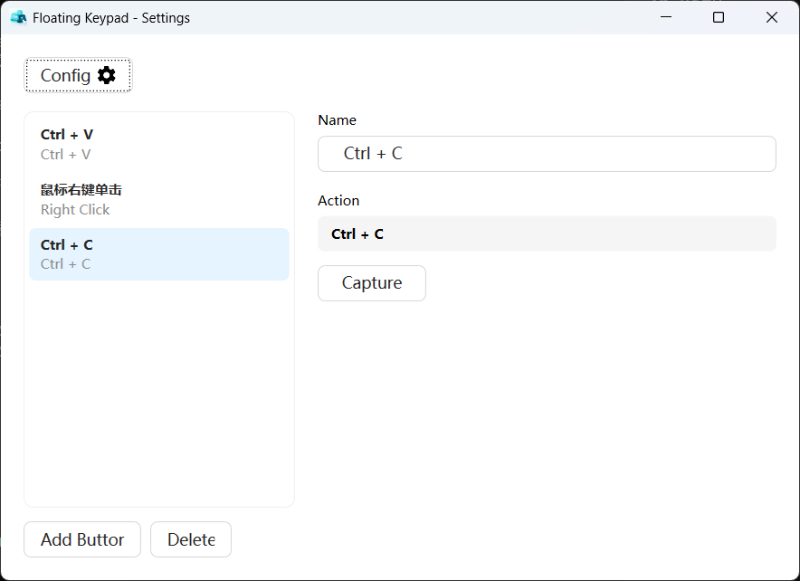
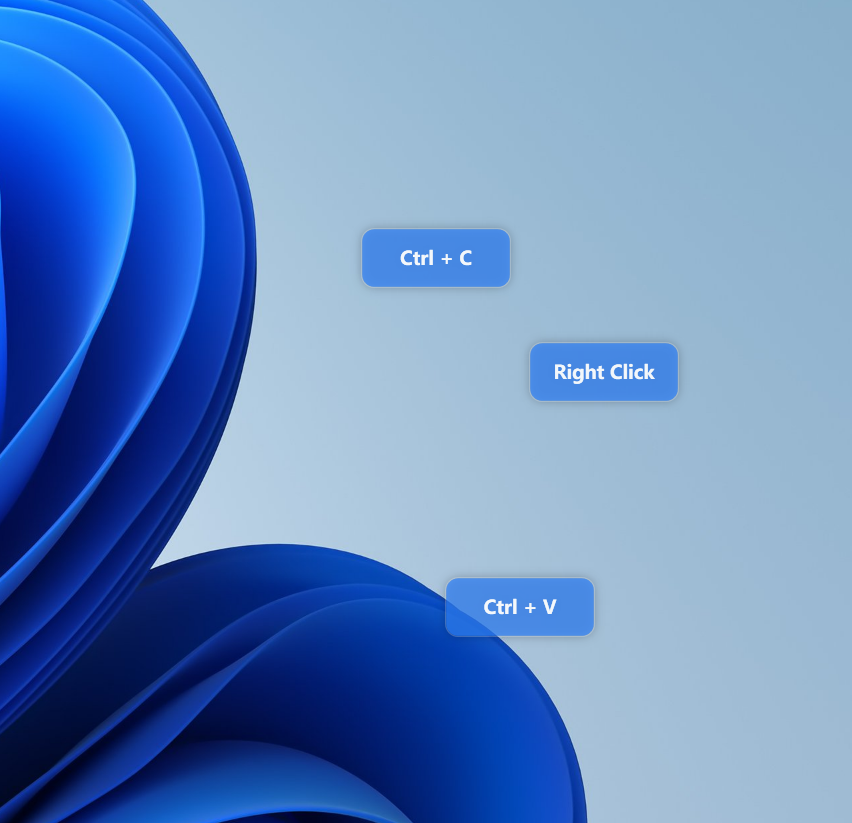

<p align="center">
  
</p>

<h1 align="center">FloatingKeypad</h1>

<p align="center">English | <a href="README.zh.md">简体中文</a></p>

A floating-button tool for Windows. Buttons float on the desktop and support custom key combinations and mouse buttons; clicking one triggers the action **without stealing focus**, sending it to the current foreground window. Useful for triggering shortcuts when remotely controlling a PC from a phone.

## Screenshots

| Main window | Floating buttons |
| --- | --- |
|  |  |

## Features

- Buttons float on the desktop and can be dragged to any position
- Custom key combinations, mouse buttons, and mixed key + mouse actions
- Clicking a button never changes the active window; the action goes to the original window
- Global appearance: width / height / opacity / background / foreground for all buttons
- Chinese / English UI
- Runs in the system tray; config persisted to `%APPDATA%\FloatingKeypad\config.json`

## Usage

Double-click `FloatingKeypad.exe` (administrator rights required). The first run creates a sample "Copy" button.

- Drag a button to move it
- Right-click a button to open settings and edit its name and bound action
- The "Config" button at the top: language and global appearance

## Build

Requires the **.NET 8 SDK on Windows** (WPF cannot be built on Linux).

```powershell
dotnet build FloatingKeypad.sln
```

Output: `D:\FloatingKeypad\build\Debug\FloatingKeypad.exe`, controlled by `DeployDir` in `Directory.Build.props`; override with `-p:DeployDir=...`.

> The output path must be a local Windows path, not a WSL UNC path (`\\wsl.localhost\...`): launching the exe from a UNC path triggers a Windows security warning, and some third-party IMEs may refuse to work.

If the source lives in WSL, build from Windows via the UNC path:

```powershell
dotnet build \\wsl.localhost\<distro>\www\FloatingKeypad\FloatingKeypad.sln
```

## Installer

One command for "self-contained publish → build installer":

```powershell
powershell -ExecutionPolicy Bypass -File build-release.ps1
```

- The version is read from `<Version>` in `src/FloatingKeypad/FloatingKeypad.csproj`
- Publish output: `D:\FloatingKeypad\publish\` (self-contained win-x64, no .NET needed)
- Installer output: `D:\FloatingKeypad\installer\FloatingKeypad-Setup-<version>.exe`

| Parameter | Description |
|---|---|
| `-Configuration` | Build configuration, default `Release` |
| `-Version` | Override version (defaults to csproj) |
| `-InnoSetupDir` | Inno Setup install directory (auto-detected by default) |
| `-FrameworkDependent` | Framework-dependent publish (~1 MB, requires .NET 8 Desktop Runtime) |

The wizard supports Simplified Chinese / English, a custom install path, and an optional desktop shortcut. It can launch the app after install, and uninstalls from Control Panel.

## Project structure

```
FloatingKeypad/
├── FloatingKeypad.sln
├── Directory.Build.props         # unified output to D:\FloatingKeypad\build\
├── build-release.ps1             # publish + build installer
├── installer/FloatingKeypad.iss  # Inno Setup script
└── src/FloatingKeypad/
    ├── app.manifest              # requireAdministrator
    ├── App.xaml(.cs)             # single instance + tray + lifecycle + language
    ├── Models/                   # InputEvent / ButtonConfig / KeyNames / AppearanceConfig
    ├── Services/                 # InputSimulator / InputHook / WindowHelper / ConfigService / TrayService / Localization
    ├── Themes/                   # Antd.xaml theme
    └── Views/                    # FloatingButtonWindow / SettingsWindow / GlobalConfigWindow / KeyCaptureDialog
```

## Configuration

`%APPDATA%\FloatingKeypad\config.json`:

```json
{
  "Language": "zh-CN",
  "Appearance": {
    "Width": 120,
    "Height": 48,
    "Opacity": 0.88,
    "Background": "#CC2D7FF9",
    "Foreground": "#FFFFFFFF"
  },
  "Buttons": [
    {
      "Id": "…",
      "Label": "复制",
      "Left": 320,
      "Top": 320,
      "Events": [{ "kind": "key", "Vk": 17, "Extended": false, "Down": true }]
    }
  ]
}
```

## How it works

- **No focus stealing**: the window uses `WS_EX_NOACTIVATE` and intercepts `WM_MOUSEACTIVATE`, returning `MA_NOACTIVATE`
- **Keyboard**: simulated globally with `SendInput`, sent to the currently focused window
- **Mouse**: sent directly with `PostMessage` to the `GetForegroundWindow()` recorded when the button was clicked
- **Key capture**: low-level keyboard / mouse hooks `WH_KEYBOARD_LL` / `WH_MOUSE_LL`

## Known limitations

- If the target app runs as administrator, this app must too (enforced via manifest)
- Games and other apps using Raw Input may not respond to keyboard simulation
- Mouse actions are sent via `PostMessage`; Chrome / Electron apps may not respond
- System-level combinations like `Win+L` are reserved by Windows and cannot be simulated

## License

[MIT](LICENSE)
